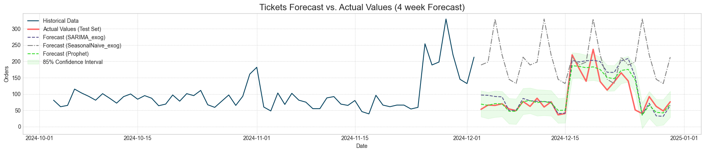
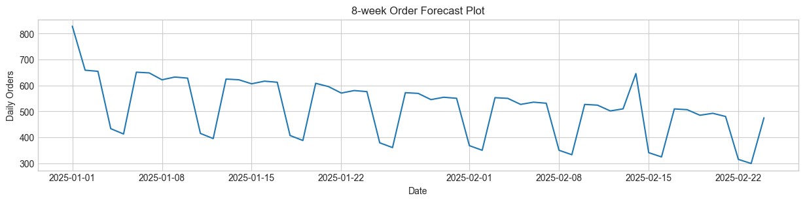
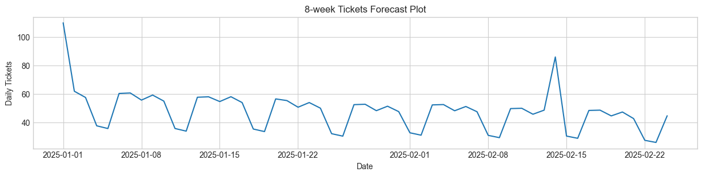

# E-Commerce Operations Demand Forecasting Analysis

## Project Overview

This repository contains the analysis and forecasting models and published for an e-commerce company aiming to optimize its customer care and fulfillment operations. By leveraging two years of historical data, this project develops demand forecasts for key metrics over 4, 6, and 8-week horizons. The primary goal is to provide actionable insights for staffing, inventory management, and warehouse capacity planning.

## Data

The analysis is based on the `daily_demand.csv` dataset, which contains 730 days of operational data.

### Dataset Schema
- **`date`**: Date of observation
- **`orders`**: Number of orders placed
- **`units_sold`**: Total units sold
- **`revenue`**: Gross merchandise value (GMV)
- **`customer_care_tickets`**: Number of support tickets created
- **`is_weekend`**: Binary flag (1 = weekend)
- **`is_holiday`**: Binary flag (1 = holiday)
- **`is_promotion`**: Binary flag (1 = promotional period)

## Key Findings

- **[Promo Impact]**: Promotional Periods have a most significant impact on both orders and customer care tickets, with July Promo (11 days) being the heaviest month in terms of orders and customer tickets in both 2023 and 2024. The mean daily orders during promo (1564) vs. for non-promo 873 mean represents almost double the daily order volumes. Despite the volatility, our model was able to forecast more accurately during this period than a regular day.
- **[Holiday Impact]**: Generally, holidays have a positive impact on both orders and customer tickets. The mean daily orders is 1145, vs. 921 for non-holidays. However, there is a noticeable decline in order volumes and tickets during Christmas, which was hard to forecast for based on 2 years of data. This part of the forecast could be further optimized with more data and feature engineering.
- **[Weekend Impact]**: We find that weekends usually have a negative impact on both order volumes and customer tickets. Over weekends, the mean daily orders is 672, vs. 1029 on weekdays. 
- **[Trends and Seasonality]**: We observed based on our forecast components, that we usually have higher orders on Tuesday and Saturday compared to other days, and similarly for customer tickets. Across the months, as we saw a heavy promo period in July each year, Peak Ordering happens from May till August. Overall, from 2023 till 2024, we have seen an increasing trend for order volumes and customer tickets, which is a positive sign for the business, but also calls for optimized capacity and productivity increase.
- **[Units Sold and Revenue]**: We didn't find a significant improvement in the forecast additionally considering these variables as features, and they seem to be highly collinear to orders and tickets. This can be explored further on if there's an opportunity to utilize.

## Model Performance Summary

A variety of forecasting models were evaluated to predict future demand. 

To build our forecast for this scenario, we selected the following 3 models:
1. **Seasonal Naive (Baseline Model)**: This will help determine  if our series is repeatable and whether more complex models are truly adding value. The other models should outperform this baseline model to be considered valueable.
2. **SARIMAX**: Suitable statistical model for trends and seasonality, easier to explain. Easy to account for special holiday/promo effects as exogenous variables.
3. **Prophet**: Automatically picks up seasonality, holidays, and changepoints, which matches classic e-commerce and retail business cycles. For this case we'll only refer to the holiday list as in our dataset and not include additional Prophet holidays. Further within Prophet, model decomposition (trend, seasonality, holiday effect) is highly interpretable and is frequently requested by business stakeholders.

The Prophet model chosen was selected based on its superior accuracy and interpretability for this specific business context. Below are the MAPE nos. we got from our model. Additional performance metrics such as mae, rmse etc. are available in the results folder of the repository as model performance files.

### Model Comparison

| Model            | Horizon | MAPE (Orders) | MAPE (Tickets) | Remarks                               |
| :---------       | :------ | :------------ | :------------- | :----------------------------------------------------- |
| **Prophet**      | 4-Week  | 15.68%        | 22.90%         |  Best Performing|
| **SARIMAX**      | 4-Week  | 25.02%        | 31.93%         |           |
| **SeasonalNaive**| 4-Week  | 109.9%        | 178.10%        | |
| **SARIMAX**      | 6-Week  | 22.50%        | 29.11%         | |
| **Prophet**      | 6-Week  | 29.67%        | 18.76%         | Best Performing|
| **SeasonalNaive**| 6-Week  | 14.62%        | 37.22%         | |
| **SARIMAX**      | 8-Week  | 20.53%        | 25.74%         | |
| **Prophet**      | 8-Week  | 39.75%        | 18.31%         | Best Performing|
| **SeasonalNaive**| 8-Week  | 14.64%        | 58.54%         | |

**Selected Model**: Prophet was chosen due to its robust performance in capturing multiple seasonalities, holidays, and the specific impact of promotional events with minimal tuning.

## Demand Forecast

The following section summarizes the demand forecast for the next 8 weeks.

### Forecast Visualizations

### Expected Demand
- Based on the next 4, 6 and 8 weeks forecast for orders and tickets. We are not expecting to see a surge in orders for the next 8 weeks, primarily as there are no expected promotions or holidays.
- There is one minor increase to about 650 orders expected in mod-Feb, which based on past volatility should be manageable by the existing workforce. Further, if the operations relies on contractual labor, they should balance the workforce to align as per the reduced demand in January and February.
- It would be more interesting to see how the model performs between May and August, additionally during Christmas next year.

## Actionable Recommendations

Based on the forecast, the following actions are recommended:

- **Customer Care**: Evaluate reduction of temporary agent staffing during the upcoming 8 weeks, considering January and February are relatively less stressful operationally.
- **Inventory & Fulfillment**: Reduce temporary workforce based on operational efficiency if possible, for warehouse staff involved in picking and packing.
- **Logistics Capacity Requirement**: Align with logistics partners to adjust capacity requirement for the upcoming low volume months.
- **Business Impact**: The upcoming recommendations, on high level are aimed at cutting costs during low operations months to ensure profitability.

## Limitations & Next Steps

### Limitations
- **Data Quality**: We observed 13 order outliers using the IQR Approach, some of which were in the range of 3000-4000 and were not explained by holidays, promos etc. For these we can further investigate if there could be additional reasons, or they might be incorrect values.  
- **Model Assumptions**: The model assumes that past relationships between demand drivers (holidays, weekends) and outcomes (orders, tickets) will hold true for the forecast horizon. For promotions specifically, we have designed the future dataframe to consider the same pattern of promotions as in 2024. However, if we know the promo calendar in advance, we can build that in for a more accurate version of the forecast.

### Next Steps
- **Additional Data**: Incorporate data on marketing spend, competitor promotions, and product-specific inventory levels to create more granular and accurate forecasts.
- **Follow-up Analysis**: Conduct A/B testing on staffing levels during a promotional period to validate the forecast's impact and refine resource allocation models. A deeper dive into the drivers of `units_sold` vs. `orders` could also yield valuable insights into customer purchasing behavior.